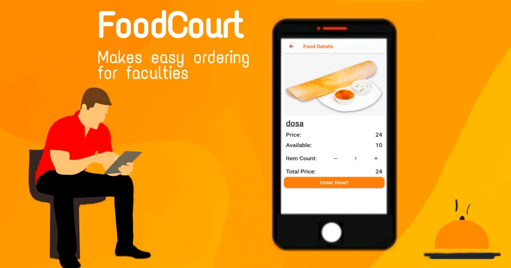
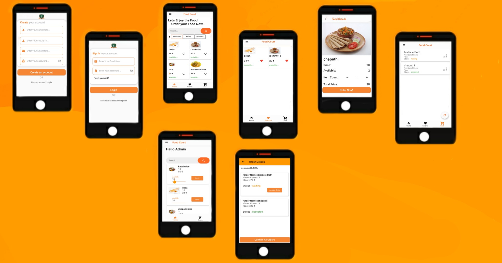

  

    
   

 

 

# About 📌
The project have 2 interfaces.  one for the faculties and other for the food court members.Faculties can check the availability of the food item and they can order the food itemif they want.  In the other hand Food court members can change the availability of theparticular food item they want to change and also can see the order details which areplaced by the faculties and can confirm the order status and accept the orders.

# Mockups 🖌️

  

    
   

 

## Getting Started

This project is a starting point for a Flutter application.

A few resources to get you started if this is your first Flutter project:

- [Lab: Write your first Flutter app](https://flutter.dev/docs/get-started/codelab)
- [Cookbook: Useful Flutter samples](https://flutter.dev/docs/cookbook)

For help getting started with Flutter, view our
[online documentation](https://flutter.dev/docs), which offers tutorials,
samples, guidance on mobile development, and a full API reference.
# Sahyadri_FoodCourt

